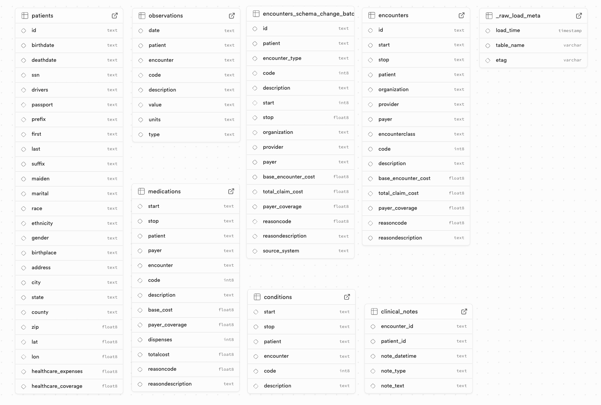

# Part A: Data Loading

### Task: Load the raw CSV files into a queryable database (e.g. DuckDB, SQLite, Postgres, other) using your preferred approach.

**Data Source:** https://github.com/londonaicentre/datatakehome/tree/main/data

Implementation: data_import.py

This script reads the CSV files directly from their source URLs and loads them into a Supabase PostgreSQL database. API access to database can be provided on request.

**Installation:**

1. Set up your database URL.
2. Ensure you have python and the pip package manager installed.
3. Ensure you have installed the required packages in `../requirements.txt`.
4. Run this command in terminal: `python 1_data_load/data_load.py`

**Corresponding database tables:**

| CSV File | Database Tables |
|----------|-------------|
| patients.csv |  raw.patients |
| encounters.csv |  raw.encounters  |
| encounters_schema_change_batch.csv | raw.encounters_schema_change_batch |
| conditions.csv | raw.conditions |
| medications.csv | raw.medications |
| observations.csv | raw.observations |
| clinical_notes.csv | raw.clinical_notes |

raw._raw_load_meta is an audit table that stores the meta data of the source file after each table load.

**Screenshot of database tables schemas from Supabase after import:**

